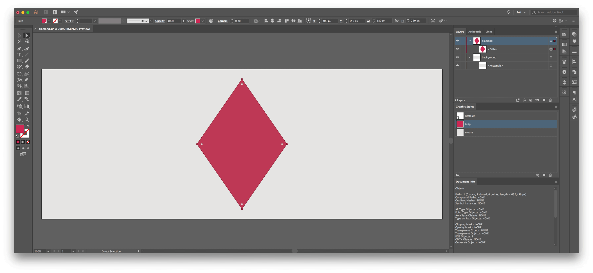
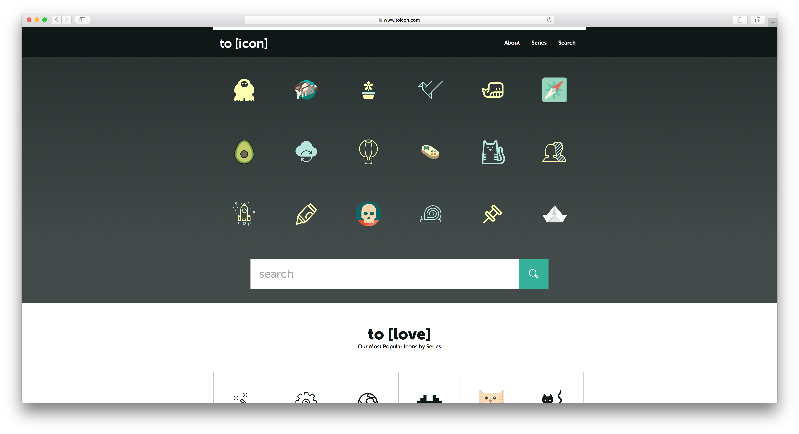

Animation on the web is hardly new. First there were GIFs, then there was Flash, now there's HTML5 and JavaScript and GIFs are retro cool. These techniques are great if you want to create dynamic web pages or small raster graphics. But what if you want to create a vector animation that's lightweight, scales well, and has [broad compatibility](https://caniuse.com/#search=css%20animation)? These circumstances are ideal for animating SVGs with CSS.

This tutorial is an introduction to the basics of SVG animation with CSS. We'll start with the basics before moving on to some samples that utilize multiple techniques. By the end of this tutorial, you will have the foundation to create complex animations.

## Getting started

### SVG

Scalable Vector Graphics or SVG is a 2D vector image format that scales to look sharp at any resolution. SVG and HTML are compatible with each other, and this means that SVG, just like HTML, are easy to modify and manipulate with CSS.

To create an SVG, you can use design tools like [Illustrator](https://www.adobe.com/fr/products/illustrator.html), [Sketch](https://www.sketchapp.com/), or [InkScape](https://inkscape.org/en/), or you can write SVG directly using the text editor of your choice.

If you're using a design tool, make sure you:

*  Pixel align elements when possible (avoid decimals for size or position)
*  Avoid unnecessary anchor points
*  Avoid overlapping elements
*  Create your image completely within the artboard
*  Export SVG 1.1



Here is a sample of what your SVG should look like. If you follow these pro tips, your artwork is almost animation-ready, but you'll still need to clean up your SVG using a text editor.

In your text editor:

*  Give shapes, paths, and groups you want to animate unique **class** names
*  Make sure your styles are defined within the **style** tags (and not on elements themselves)

To keep things simple in this tutorial, all CSS styles will be contained within the SVG.


### HTML + CSS

HTML and CSS are like Russian dolls. HTML describes the number and the order of dolls. CSS defines a doll style like the color of its decorative paintings.

HyperText Markup Language or HTML is used to create the content and the structure of a page. Syntactically, HTML markups wrap most elements between tags made of brackets.

Cascading Style Sheets or CSS determines the look and feel of a page in a browser. CSS let you style HTML and XML, which is the language used for SVG. CSS syntax consists of a selector to target the element to style and a property with its value to define the style.

You can insert CSS code at two different places to style an SVG, either inside the SVG tags, either in an external file. When inside the SVG tags, styles can be on the SVG element itself or within **style** tags. In the following snippet, CSS styles are contained within the SVG, and within **style** tags.

```html
<svg version="1.1" xmlns="http://www.w3.org/2000/svg" viewBox="0 0 800 300">
    <style> .mouse{fill:#E5E4E3;} .tulip{fill:#CC2954;} </style>
    <rect class="mouse" x="0" y="0" width="800" height="300"/>
    <polygon class="tulip" points="400, 280, 310, 150, 400, 20, 490, 150"/>
</svg>
```

<svg version="1.1" xmlns="http://www.w3.org/2000/svg" viewBox="0 0 800 300">
    <style> .mouse{fill:#E5E4E3;} .tulip{fill:#CC2954;} </style>
    <rect class="mouse" x="0" y="0" width="800" height="300"/>
    <polygon class="tulip" points="400, 280, 310, 150, 400, 20, 490, 150"/>
</svg>


## Getting started with animations

Understanding references and keyframes concepts are essential to animate with CSS. Duration, iteration, easing and delay are also simple yet useful properties. Content is mainly based on [MDN web docs](https://developer.mozilla.org/en-US/docs/Web/CSS/CSS_Animations)

### 1. References

```css
.diamond{
    animation-name: diamondMoves;
}

@keyframes diamondMoves { }
```

The `animation-name` links the animation target to the animations actions.

The `animation-name` is a key concept, used twice for different references. First, the animation name is associated with the target element. Here the target is the diamond **class**. Then, the animation name is placed after **@keyframes**. The name role here is to hold the list of your animation actions.

The possible values are:

* letters
* numbers
* underscores
* dashes

### 2. Keyframes

```css
@keyframes diamondMoves {
    from {transform: translateX(0);}
    to {transform: translateX(400px);}
}
```
```css
@keyframes diamondMoves {
    0% {transform: translateX(0);}
    50% {transform: translateX(100px);}
    100% {transform: translateX(400px);}
}
```

The `@Keyframes` function indicates what should happen at what moment in the animation cycle. It carries a list of all the steps your target will go through along the whole animation sequence. An individual list item controls the aspect of the target element at a given time. Each, element of the list or keyframe rule, contains a time stamp followed by a property and a value.

As shown in the example, to specify the state of the target at the beginning and at the end of an animation, you can use the keywords `from` and `to`. They are equivalent to `0%` and `100%`. As the second snippet shows, you can add as many keyframes as you need in between the start and the end. These steps play at different times depending on the total duration of an animation that is described by another `animation-duration` property.

Possible keyframes units are:

* keywords `from` and `to`
* percentages, like `0%`


### 3. Duration

```css
.diamond{
    animation-name: diamondMoves;
    animation-duration: 6s;
}
```

The `animation-duration` property indicates how long the animation takes to run from start to end.

The duration cycle is specified in time. The value should be equal or superior to 0.

Possible time units are:

* seconds, like `6s`
* milliseconds, like `6000ms`

The initial value is `0s`.

### 4. Iteration

```css
.diamond{
    animation-name: diamondMoves;
    animation-duration: 6s;
    animation-iteration-count: 1;
}
```

The `animation-iteration-count` property indicates how many times the animation sequence repeats.

Possible values are:

* a whole number (integer) or a decimal number like `0,5` or `1`
* the keyword `infinite` to have the animation repeats forever.

The initial value is `1`.

### 5. Easing

```css
.diamond{
    animation-name: diamondMoves;
    animation-duration: 6s;
    animation-iteration-count: 1;
    animation-timing-function: linear;
}
```

The `animation-timing-function` property indicates how speed is shared along the animation. Easing helps to make animations feel more natural and smoother. You can apply easing on individual keyframes.

Possible values are:

* the keywords `ease`, `ease-in`, `ease-out`, `ease-in-out`, `linear`, `step-start`, `step-end`.
* a function, like `frames(5)`.

The initial value is `ease`.

### 6. Delay

```css
.diamond{
    animation-name: diamondMoves;
    animation-duration: 6s;
    animation-iteration-count: 1;
    animation-timing-function: linear;
    animation-delay: 4s;
}
```

The `animation-delay` property indicates when the animation starts.

The duration of the delay is specified in time. A positive value delays the start of the animation. 0 makes the animation start directly. A negative value makes the animation start directly as well but it skips the states of the target that were played before 0.

Possible time units are:

* seconds, like `6s`
* milliseconds, like `6000ms`

The initial value is `0s`.


## CSS transform animations

CSS transform animations include rotation, translation, scaling, and skewing. We will see in this part, for each of these transform properties, an example, a definition, and some possible syntaxes and values.

Before starting to animate a SVG, you should know that the origin point of an SVG element is located at 0, 0 of the artwork. It means that, by default, the reference point from which the transformation occurs is the top left corner and not the center of the artwork. However, CSS `transform-origin` property lets you change the position of this origin point.

The syntax can use one or two values. The first value is by default for the `x-offset`, the second value is for the `y-offset`.

Possible values and units are:

* a length in pixels or in centimeters, like `2px` and `2cm`.
* a keyword or its corresponding percentages `left` or `0%` , `right` or `100%`, `top` or `0%`, `bottom` or `100%`, and `center` or `50%`.

```html
<svg version="1.1" xmlns="http://www.w3.org/2000/svg" viewBox="0 0 800 300">
    <rect class="mouse" x="0" y="0" width="800" height="300"/>
    <polygon class="diamondOr tulip" points="400, 280, 310, 150, 400, 20, 490, 150"/>
    <style>
    .mouse{fill:#E5E4E3;}
    .tulip{fill:#CC2954;}
    .diamondOr {
        animation-name: diamondOrigin;
        animation-duration: 4s;
        animation-iteration-count: infinite;
    }
    @keyframes diamondOrigin {
        from {transform: rotate(0deg);}
        to {transform: rotate(360deg);}
    }
    </style>
</svg>
```

<svg version="1.1" xmlns="http://www.w3.org/2000/svg" viewBox="0 0 800 300">
    <rect class="mouse" x="0" y="0" width="800" height="300"/>
    <polygon class="diamondOr tulip" points="400, 280, 310, 150, 400, 20, 490, 150"/>
    <style>
    .mouse{fill:#E5E4E3;}
    .tulip{fill:#CC2954;}
    .diamondOr {
        animation-name: diamondOrigin;
        animation-duration: 4s;
        animation-iteration-count: infinite;
    }
    @keyframes diamondOrigin {
        from {transform: rotate(0deg);}
        to {transform: rotate(360deg);}
    }
    </style>
</svg>
In this example, the diamond rotates from its default origin point, in the top left corner.

```html
<svg version="1.1" xmlns="http://www.w3.org/2000/svg" viewBox="0 0 800 300">
    <rect class="mouse" x="0" y="0" width="800" height="300"/>
    <polygon class="diamondOrCh tulip" points="400, 280, 310, 150, 400, 20, 490, 150"/>
    <style>
        .mouse{fill:#E5E4E3;}
        .tulip{fill:#CC2954;}
        .diamondOrCh {
            animation-name: diamondOriginChanged;
            animation-duration: 4s;
            animation-iteration-count: infinite;
            transform-origin: 50% 50%;
        }
        @keyframes diamondOriginChanged {
            from {transform: rotate(0deg);}
            to {transform: rotate(360deg);}
        }
    </style>
</svg>
```

<svg version="1.1" xmlns="http://www.w3.org/2000/svg" viewBox="0 0 800 300">
    <rect class="mouse" x="0" y="0" width="800" height="300"/>
    <polygon class="diamondOrCh tulip" points="400, 280, 310, 150, 400, 20, 490, 150"/>
    <style>
        .mouse{fill:#E5E4E3;}
        .tulip{fill:#CC2954;}
        .diamondOrCh {
            animation-name: diamondOriginChanged;
            animation-duration: 4s;
            animation-iteration-count: infinite;
            transform-origin: 50% 50%;
        }
        @keyframes diamondOriginChanged {
            from {transform: rotate(0deg);}
            to {transform: rotate(360deg);}
        }
    </style>
</svg>
In this example, `transform-origin: 50% 50%;` is added. The origin point is set to the center so the diamond rotates from its center.

### Rotate

The `rotate` animation moves an object circularly around a point.

The rotate animation is written `rotate(a)`, in which `a` is an `<angle>` composed of a value and a unit. The `<angle>` defines the amount of rotation. It is composed of a value followed by a unit. A positive value makes the rotation go clockwise and a negative value makes the rotation go counterclockwise.

Possible `<angle>` units are:

* degrees, like `90deg`
* turns, like `1.5turn`
* radians, like `1.64rad`


```html
<svg version="1.1" xmlns="http://www.w3.org/2000/svg" viewBox="0 0 800 300">
    <rect class="mouse" x="0" y="0" width="800" height="300"/>
    <polygon class="diamondTu tulip" points="400, 280, 310, 150, 400, 20, 490, 150"/>
    <style>
        .mouse{fill:#E5E4E3;}
        .tulip{fill:#CC2954;}
        .diamondTu {
            animation-name: diamondTurns;
            animation-duration: 4s;
            animation-iteration-count: infinite;
            transform-origin: 50% 50%;
        }
        @keyframes diamondTurns {
            0% {transform: rotate(0deg);}
            50% {transform: rotate(-90deg);}
            100% {transform: rotate(0deg);}
        }
    </style>
</svg>
```

<svg version="1.1" xmlns="http://www.w3.org/2000/svg" viewBox="0 0 800 300">
    <rect class="mouse" x="0" y="0" width="800" height="300"/>
    <polygon class="diamondTu tulip" points="400, 280, 310, 150, 400, 20, 490, 150"/>
    <style>
        .mouse{fill:#E5E4E3;}
        .tulip{fill:#CC2954;}
        .diamondTu {
            animation-name: diamondTurns;
            animation-duration: 4s;
            animation-iteration-count: infinite;
            transform-origin: 50% 50%;
        }
        @keyframes diamondTurns {
            0% {transform: rotate(0deg);}
            50% {transform: rotate(-90deg);}
            100% {transform: rotate(0deg);}
        }
    </style>
</svg>
In this example, the diamond starts and ends standing straight, but in the middle keyframe, it rotates counterclockwise from a 90-degree angle.

### Translate

The `translate` animation moves an object from a point to another based on the coordinate given along the abscissa and the ordinate axis.

The syntax can use one or two values. It can be written `translate(tx)` or `translate(tx, ty)`, in which `t` is a length composed of a value and a unit. Along the X axis, a positive value makes the object move right, and a negative value makes the object move left. Along the Y axis, a positive value makes the object move down, and a negative value makes the object move up.

Possible length units are:

* pixels, like `200px`
* percentages, like `50%`

```html
<svg version="1.1" xmlns="http://www.w3.org/2000/svg" viewBox="0 0 800 300">
    <rect class="mouse" x="0" y="0" width="800" height="300"/>
    <polygon class="diamondMo tulip" points="400, 280, 310, 150, 400, 20, 490, 150"/>
    <style>
        .mouse{fill:#E5E4E3;}
        .tulip{fill:#CC2954;}
        .diamondMo {
            animation-name: diamondMoves;
            animation-duration: 8s;
            animation-iteration-count: infinite;
            transform-origin: 50% 50%;
        }
        @keyframes diamondMoves {
            0% {transform: translate(0, 0);}
            20% {transform: translate(0, -200px);}
            30% {transform: translate(0, 0);}
            40% {transform: translate(0, 200px);}
            50% {transform: translate(0, 0);}
            60% {transform: translate(-200px, 0);}
            70% {transform: translate(0, 0);}
            80% {transform: translate(200px, 0);}
            100% {transform: translate(0, 0);}
        }
    </style>
</svg>
```

<svg version="1.1" xmlns="http://www.w3.org/2000/svg" viewBox="0 0 800 300">
    <rect class="mouse" x="0" y="0" width="800" height="300"/>
    <polygon class="diamondMo tulip" points="400, 280, 310, 150, 400, 20, 490, 150"/>
    <style>
        .mouse{fill:#E5E4E3;}
        .tulip{fill:#CC2954;}
        .diamondMo {
            animation-name: diamondMoves;
            animation-duration: 8s;
            animation-iteration-count: infinite;
            transform-origin: 50% 50%;
        }
        @keyframes diamondMoves {
            0% {transform: translate(0, 0);}
            20% {transform: translate(0, -200px);}
            30% {transform: translate(0, 0);}
            40% {transform: translate(0, 200px);}
            50% {transform: translate(0, 0);}
            60% {transform: translate(-200px, 0);}
            70% {transform: translate(0, 0);}
            80% {transform: translate(200px, 0);}
            100% {transform: translate(0, 0);}
        }
    </style>
</svg>
In this example, the diamond starts from the center of the canvas, then, it moves 200 pixels to the top, comes back to the center, moves 200 pixels to the bottom, comes back to the center, moves 200 pixels to the left, and comes back to the center. Finally, it moves 200 pixels to the right and comes back to the center.

### Scale

The `scale` animation resizes an object.

Scaling can either keep the object ratio intact, or it can distort it if the the horizontal and vertical scaling are different. The syntax can use one, or two values. It can be written `scale(sx)` or `scale(sx, sy)`, in which `s` is your amount of scaling. Your value can be a whole number (integer) or a decimal number. A value bigger than 0 and smaller than 1 shrinks the element, and a value over 1 enlarges the element.


```html
<svg version="1.1" xmlns="http://www.w3.org/2000/svg" viewBox="0 0 800 300">
    <rect class="mouse" x="0" y="0" width="800" height="300"/>
    <polygon class="diamondSc tulip" points="400, 280, 310, 150, 400, 20, 490, 150"/>
    <style>
        .mouse{fill:#E5E4E3;}
        .tulip{fill:#CC2954;}
        .diamondSc {
            animation-name: diamondScale;
            animation-duration: 4s;
            animation-iteration-count: infinite;
            transform-origin: 50% 50%;
        }
        @keyframes diamondScale {
            0% {transform: scale(0.5);}
            50% {transform: scale(1.5);}
            100% {transform: scale(0.5);}
        }
    </style>
</svg>
```

<svg version="1.1" xmlns="http://www.w3.org/2000/svg" viewBox="0 0 800 300">
    <rect class="mouse" x="0" y="0" width="800" height="300"/>
    <polygon class="diamondSc tulip" points="400, 280, 310, 150, 400, 20, 490, 150"/>
    <style>
        .mouse{fill:#E5E4E3;}
        .tulip{fill:#CC2954;}
        .diamondSc {
            animation-name: diamondScale;
            animation-duration: 4s;
            animation-iteration-count: infinite;
            transform-origin: 50% 50%;
        }
        @keyframes diamondScale {
            0% {transform: scale(0.5);}
            50% {transform: scale(1.5);}
            100% {transform: scale(0.5);}
        }
    </style>
</svg>
In this example, the diamond starts and ends at half its defined size. In the middle of the animation, it grows to reach 1,5 times its original size.

### Skew

The `skew` animation transforms an object along an oblique angle. It distorts each point of the SVG element that is not directly located on the X and Y axises by a certain angle in the horizontal and vertical directions.

The syntax can use one or two values. The skew animation can be written `skew(ax)`, `skew(ax, ay)`, `skewX(a)`, or `skewY(a)`, where `a` is an `<angle>` composed of a value and a unit. The amount of skewing is defined by the values of an `<angle>`. The greater your value is, the most distorted your object is.

The value is followed by a unit.

Possible `<angle>` units are:

* degrees, like `90deg`
* turns, like `1.5turn`
* radians, like `1.64rad`


```html
<svg version="1.1" xmlns="http://www.w3.org/2000/svg" viewBox="0 0 800 300">
    <rect class="mouse" x="0" y="0" width="800" height="300"/>
    <polygon class="diamondSk tulip" points="400, 280, 310, 150, 400, 20, 490, 150"/>
    <style>
        .mouse{fill:#E5E4E3;}
        .tulip{fill:#CC2954;}
        .diamondSk {
            animation-name: diamondSkew;
            animation-duration: 4s;
            animation-iteration-count: infinite;
            transform-origin: 50% 50%;
        }
        @keyframes diamondSkew {
            0% {transform: skew(0);}
            25% {transform: skew(-35deg);}
            50% {transform: skew(0);}
            75% {transform: skew(35deg);}
            100% {transform: skew(0);}
        }
    </style>
</svg>
```

<svg version="1.1" xmlns="http://www.w3.org/2000/svg" viewBox="0 0 800 300">
    <rect class="mouse" x="0" y="0" width="800" height="300"/>
    <polygon class="diamondSk tulip" points="400, 280, 310, 150, 400, 20, 490, 150"/>
    <style>
        .mouse{fill:#E5E4E3;}
        .tulip{fill:#CC2954;}
        .diamondSk {
            animation-name: diamondSkew;
            animation-duration: 4s;
            animation-iteration-count: infinite;
            transform-origin: 50% 50%;
        }
        @keyframes diamondSkew {
            0% {transform: skew(0);}
            25% {transform: skew(-35deg);}
            50% {transform: skew(0);}
            75% {transform: skew(35deg);}
            100% {transform: skew(0);}
        }
    </style>
</svg>
In this example, the diamond starts and ends undistorted. In the middle of the animation, the diamond points are skewed from a negative 35-degrees angle. Then, the diamond comes back to its original shape before skewing from a positive 35-degrees angle.


## Other CSS animations

Aside from transform properties, CSS animation also include color fill, fill mode, stroke animation, opacity changes, and animation direction. We will see in this part, for each of this animation, one example, a definition of the animation, and its possible values.

### Color

The color of an object is defined by the `fill` property.

Possible values:

* a keyword, like `pink`
* a color code, like RGB `rgb(204, 41, 84)`, RGBA `rgba(204, 41, 84, 0.5)`, or Hex like `#CC2954`

```html
<svg version="1.1" xmlns="http://www.w3.org/2000/svg" viewBox="0 0 800 300">
    <rect class="mouse" x="0" y="0" width="800" height="300"/>
    <polygon class="diamondCo tulip" points="400, 280, 310, 150, 400, 20, 490, 150"/>
    <style>
        .mouse{fill:#E5E4E3;}
        .tulip{fill:#CC2954;}
        .diamondCo {
            animation-name: diamondColor;
            animation-duration: 4s;
            animation-iteration-count: 1;
        }
        @keyframes diamondColor{
            0% {fill:#CC2954;}
            100% {fill:#F2F230;}
            }
    </style>
</svg>
```

<svg version="1.1" xmlns="http://www.w3.org/2000/svg" viewBox="0 0 800 300">
    <rect class="mouse" x="0" y="0" width="800" height="300"/>
    <polygon class="diamondCo tulip" points="400, 280, 310, 150, 400, 20, 490, 150"/>
    <style>
        .mouse{fill:#E5E4E3;}
        .tulip{fill:#CC2954;}
        .diamondCo {
            animation-name: diamondColor;
            animation-duration: 4s;
            animation-iteration-count: 1;
        }
        @keyframes diamondColor{
            0% {fill:#CC2954;}
            100% {fill:#F2F230;}
            }
    </style>
</svg>
In this animation played once, the color of the diamond changes from tulip to lime. When the animation ends, the diamond fill goes back to the tulip color of the beginning.

### Fill Mode

The `animation-fill-mode` property defines the first state of your object at the beginning of the animation and the last state of your object at the end of the animation.

Possible values:

* `none`
* `forwards`, applies the value of the last keyframe at the end of the animation. It can be influenced by `animation-direction` and `animation-iteration-count`.
* `backwards`, applies the value of the first keyframe at the beginning of the animation. If an `animation-delay` is set, the target will keep the value of the first keyframes until the animation starts. It can be influenced by `animation-direction` as well.
* `both`, applies the value of the first keyframe at the beginning and the value of the last keyframe at the end of the animation.

The initial value is `none`.

```html
<svg version="1.1" xmlns="http://www.w3.org/2000/svg" viewBox="0 0 800 300">
    <rect class="mouse" x="0" y="0" width="800" height="300"/>
    <polygon class="diamondFi mouse" points="400, 280, 310, 150, 400, 20, 490, 150"/>
    <style>
        .mouse{fill:#E5E4E3;}
        .tulip{fill:#CC2954;}
        .diamondFi {
            animation-name: diamondFillMode;
            animation-duration: 4s;
            animation-iteration-count: 1;
            animation-fill-mode: forwards;
        }
        @keyframes diamondFillMode{
            0% {fill:#CC2954;}
            100% {fill:#F2F230;}
        }
    </style>
</svg>
```

<svg version="1.1" xmlns="http://www.w3.org/2000/svg" viewBox="0 0 800 300">
    <rect class="mouse" x="0" y="0" width="800" height="300"/>
    <polygon class="diamondFi mouse" points="400, 280, 310, 150, 400, 20, 490, 150"/>
    <style>
        .mouse{fill:#E5E4E3;}
        .tulip{fill:#CC2954;}
        .diamondFi {
            animation-name: diamondFillMode;
            animation-duration: 4s;
            animation-iteration-count: 1;
            animation-fill-mode: forwards;
        }
        @keyframes diamondFillMode{
            0% {fill:#CC2954;}
            100% {fill:#F2F230;}
        }
    </style>
</svg>
In this animation played once, the color of the diamond changes from tulip to lime. When the animation ends, the diamond has the lime color. The animation remembers and extends the last keyframe because of the property `animation-fill-mode: forwards;`.

### Stroke

The `stroke` attributes defines the color of an object line.

Possible values:

* a keyword, like `pink`
* a color code, like RGB `rgb(204, 41, 84)`, RGBA `rgba(204, 41, 84, 0.5)`, or Hex like `#CC2954`

The default value for the color of the `stroke` attribute is `none`.

Stroke has several other properties such as `stroke-width` for the thickness of the line, `stroke-linecap` for the appearance of the edge of the line, and `stroke-linejoin` for the appearance of the angles of the line.

The `stroke-dasharray` defines the look of a stroked path. It indicates the length of the dashes and the length of the gaps in between the dashes. The `stroke-dashoffset` defines the space before the first dash location. The values of these two properties should be lengths.

Possible length units are:

* no specified units, like `2`
* em, like `2em`
* pixels, like `2px`
* percentages, like `20%`


```html
<svg version="1.1" xmlns="http://www.w3.org/2000/svg" viewBox="0 0 800 300">
    <rect class="mouse" x="0" y="0" width="800" height="300"/>
    <path class="diamondSt pathTulip" d="M400,280l-90-130l90-130l90,130L400,280z"/>
    <style>
        .mouse{fill:#E5E4E3;}
        .pathTulip{
            fill:#E5E4E3;
            stroke:#CC2954;
            stroke-width: 10px;
            stroke-linejoin: round;
            stroke-linecap: round;
            stroke-dasharray: 1000;
            stroke-dashoffset: 1000; }
        .diamondSt {
            animation-name: diamondStroke;
            animation-duration: 4s;
            animation-iteration-count: infinite;
        }
        @keyframes diamondStroke {
            0% {stroke-dashoffset: 1000;}
            50% {stroke-dashoffset: 0;}
            100% {stroke-dashoffset: 1000;}
        }
    </style>
</svg>
```

<svg version="1.1" xmlns="http://www.w3.org/2000/svg" viewBox="0 0 800 300">
    <rect class="mouse" x="0" y="0" width="800" height="300"/>
    <path class="diamondSt pathTulip" d="M400,280l-90-130l90-130l90,130L400,280z"/>
    <style>
        .mouse{fill:#E5E4E3;}
        .pathTulip{
            fill:#E5E4E3;
            stroke:#CC2954;
            stroke-width: 10px;
            stroke-linejoin: round;
            stroke-linecap: round;
            stroke-dasharray: 1000;
            stroke-dashoffset: 1000; }
        .diamondSt {
            animation-name: diamondStroke;
            animation-duration: 4s;
            animation-iteration-count: infinite;
        }
        @keyframes diamondStroke {
            0% {stroke-dashoffset: 1000;}
            50% {stroke-dashoffset: 0;}
            100% {stroke-dashoffset: 1000;}
        }
    </style>
</svg>
In this animation, the diamond stroke has very long dashes and gaps. You can only see a continuous stroke because the dash is longer than the length of the diamond outline. Keyframes are animating the dash offset to simulate that the path is drawn from a point to all the other points forming the shape. Once the dash reaches the original point, it goes back to the original offset value.

### Opacity

The `opacity` attribute defines the amount of translucence of an object.

The possible values are :
* a whole or a decimal number from `0` transparent to `1` opaque, like `0.2`.
* a percentage, like `20%`.

```html
<svg version="1.1" xmlns="http://www.w3.org/2000/svg" viewBox="0 0 800 300">
    <rect class="mouse" x="0" y="0" width="800" height="300"/>
    <polygon class="diamondOp tulip" points="400, 280, 310, 150, 400, 20, 490, 150"/>
    <style>
        .mouse{fill:#E5E4E3;}
        .tulip{fill:#CC2954;}
        .diamondOp {
            animation-name: diamondOpacity;
            animation-duration: 4s;
            animation-iteration-count: infinite;
        }
        @keyframes diamondOpacity {
            0% { opacity: 1; }
            50% { opacity: 0.1; }
            100% {opacity: 1; }
        }
    </style>
</svg>
```

<svg version="1.1" xmlns="http://www.w3.org/2000/svg" viewBox="0 0 800 300">
    <rect class="mouse" x="0" y="0" width="800" height="300"/>
    <polygon class="diamondOp tulip" points="400, 280, 310, 150, 400, 20, 490, 150"/>
    <style>
        .mouse{fill:#E5E4E3;}
        .tulip{fill:#CC2954;}
        .diamondOp {
            animation-name: diamondOpacity;
            animation-duration: 4s;
            animation-iteration-count: infinite;
        }
        @keyframes diamondOpacity {
            0% { opacity: 1; }
            50% { opacity: 0.1; }
            100% {opacity: 1; }
        }
    </style>
</svg>
In this example, the shape starts and ends with a transparency of a 100%. In the middle of the animation, the diamond reaches a transparency of 10%.

### Direction

The `animation-direction` property defines the reading direction of an animation. This property is useful to easily create loops.

Possible values are the keywords:

* `normal` to play the way described in the keyframes
* `reverse` to play the animation backwards
* `alternate` to alternatively play forwards and backwards at each iteration
* `alternate-reverse` to alternatively play backwards and forwards at each iteration

The initial value is `normal`.

```html
<svg version="1.1" xmlns="http://www.w3.org/2000/svg" viewBox="0 0 800 300">
    <rect class="mouse" x="0" y="0" width="800" height="300"/>
    <polygon class="diamondMoBa tulip" points="400, 280, 310, 150, 400, 20, 490, 150"/>
    <style>
        .mouse{fill:#E5E4E3;}
        .tulip{fill:#CC2954;}
        .diamondMoBa {
            animation-name: diamondMovesBack;
            animation-duration: 4s;
            animation-iteration-count: infinite;
            transform-origin: 50% 50%;
            animation-direction: alternate-reverse;
        }
        @keyframes diamondMovesBack {
            0% {transform: translate(0, 0);}
            100% {transform: translate(200px, 0);}
        }
    </style>
</svg>
```

<svg version="1.1" xmlns="http://www.w3.org/2000/svg" viewBox="0 0 800 300">
    <rect class="mouse" x="0" y="0" width="800" height="300"/>
    <polygon class="diamondMoBa tulip" points="400, 280, 310, 150, 400, 20, 490, 150"/>
    <style>
        .mouse{fill:#E5E4E3;}
        .tulip{fill:#CC2954;}
        .diamondMoBa {
            animation-name: diamondMovesBack;
            animation-duration: 4s;
            animation-iteration-count: infinite;
            transform-origin: 50% 50%;
            animation-direction: alternate-reverse;
        }
        @keyframes diamondMovesBack {
            0% {transform: translate(0, 0);}
            100% {transform: translate(200px, 0);}
        }
    </style>
</svg>

This animation iteration is set to `infinite`, and the animation direction is set to `alternate-reverse`. That is why the animation is looping even if the start and the end keyframes are not similar.


## CSS animations common use

### Hover states

Hover states usually indicate to a website visitor using a pointing device that an element is interactive. CSS animations are very convenient to create animations when the user hovers on SVG elements. CSS easily allow changing the color of a button, scaling the clickable element, or even morphing an icon to another shape.

In [to icon](https://www.toicon.com/) project for instance, hover states use the CSS scaling property on SVG. To [icon] is a site where you can download high quality icons series for free.

<!-- Place here the live example -->


### Logo animations

You may want to add animations to your logo to make it unique and personal.


### Illustrated animations

You may want to use CSS animation on line drawings like [Polygon did with a ps4](https://www.polygon.com/a/ps4-review/ps4-review/), or for looping sceneries wether they are abstract or figurative sequences.

Find our P animated illustration for the 36 Days of type challenge.


## Conclusion

CSS animations are not ideal to animate photo-realistic and organic effects, or for designing a complex sequence of interactions but they provide an easy solution for scalable vectorial animation on the web. It is a lightweight technology, broadly supported on the web that is also future-proof. CSS provides an easy way to control time features like keyframes, duration, iteration, easing, and delay. The language easily allows transformations such as rotations, translations, scaling, and skewing. Changing styles, and animating a stroke are also easy thank to the language straightforward expressions. You can see more examples based on the basic concepts of this tutorial on our [CodePen collection](https://codepen.io/collection/DbqLwL/)

We wish you a very good luck to create your own CSS animation on SVG. Don't hesitate to send us your feedback on this tutorial, or to share your CSS animation creations!
