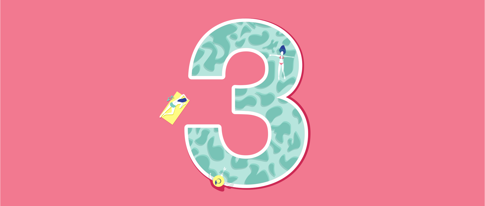

Animation on the web is hardly new. First there were GIFs, then there was Flash, now there's HTML5 and JavaScript and GIFs are retro cool. These techniques are great if you want to create dynamic web pages or small raster graphics. But what if you want to create a vector animation that's lightweight, scales well, and has [broad compatibility](https://caniuse.com/#search=css%20animation)? These circumstances are ideal for animating SVGs with CSS.

This tutorial is an introduction to the basics of SVG animation with CSS. We'll start with the basics before moving on to some samples that utilize multiple techniques. By the end of this tutorial, you will have the foundation to create complex animations.

## Getting Started

### SVG

Scalable Vector Graphics or SVG is a 2D vector image format that scales to look sharp at any resolution. SVG and HTML are peers, and this means that SVG is just as easy to modify and manipulate with CSS.

To create an SVG, you can use design tools like [Illustrator](https://www.adobe.com/fr/products/illustrator.html), [Sketch](https://www.sketchapp.com/), or [InkScape](https://inkscape.org/en/), or you can write SVG directly using the text editor of your choice.

If you're using a design tool, make sure you:

*  Pixel align elements when possible (avoid decimals for size or position)
*  Avoid unnecessary anchor points
*  Avoid overlapping elements
*  Create your image completely within the artboard
*  Export SVG 1.1


Here is a sample of what your SVG should look like. If you follow these tips, your artwork is almost animation-ready, but you'll probably still want to clean up your SVG code using a text editor or tool like [SVGOMG](https://jakearchibald.github.io/svgomg/).

In particular, made sure to:

*  Give shapes, paths, and groups you want to animate unique **class names**
*  Make sure your styles are defined within the `style` tags (and not on elements themselves)

### CSS Basics

Cascading Style Sheets or CSS determines the look and feel of a page in a browser. CSS let you style HTML and SVG elements similarly. CSS syntax consists of a selector to target an element then a property and its value to define the style.

It is possible to declare CSS styles outside an SVG code block in a surrounding HTML page, or in an eternal stylesheet file. To keep things simple in this tutorial, all CSS styles will be contained within the SVG.

While styles can be on the SVG element itself, in our snippets CSS styles are declared within `style` tags:

```html
<svg version="1.1" xmlns="http://www.w3.org/2000/svg" viewBox="0 0 800 300">
    <style>
      .mouse { fill: #E5E4E3; }
      .tulip { fill: #CC2954; }
    </style>
    <rect class="mouse" x="0" y="0" width="800" height="300"/>
    <polygon class="tulip" points="400, 280, 310, 150, 400, 20, 490, 150"/>
</svg>
```

<svg version="1.1" xmlns="http://www.w3.org/2000/svg" viewBox="0 0 800 300">
    <style>
        .mouse { fill: #E5E4E3; }
        .tulip { fill: #CC2954; }
    </style>
    <rect class="mouse" x="0" y="0" width="800" height="300"/>
    <polygon class="tulip" points="400, 280, 310, 150, 400, 20, 490, 150"/>
</svg>

## Getting Started With Animations

Understanding references and keyframes is essential to animate with CSS. Duration, iteration, easing, and delay are also simple yet useful properties. The [MDN web docs](https://developer.mozilla.org/en-US/docs/Web/CSS/CSS_Animations) are a great resource for examples.

### 1. References

```css
.diamond {
    animation-name: diamondMoves;
}

@keyframes diamondMoves { }
```

The `animation-name` links the animation target to the animations actions.

The `animation-name` is a key concept, appearing twice. First, the animation name is associated with the target element. Here the target is the diamond **class name**. Then, the animation is declared with this name within `@keyframes`. This named animation will hold the list of your animation actions.

### 2. Keyframes

```css
@keyframes diamondMoves { 
    from { transform: translateX(0); }
    to   { transform: translateX(400px); }
}
```

```css
@keyframes diamondMoves { 
    0%   { transform: translateX(0); }
    50%  { transform: translateX(100px); }
    100% { transform: translateX(400px); }
}
```

The `@Keyframes` function indicates what should happen at specific moments in the animation cycle. It carries a list of all the steps your target will go through along the whole  sequence. Each individual list item is a keyframe rule, containing a time stamp followed by a property and a value.

As shown in the examples above, to specify the state of the target at the beginning and at the end of an animation you can use the keywords `from` and `to`. They are equivalent to `0%` and `100%`. As the second snippet shows, you can add as many keyframes as you need in between the start and the end. These steps play at different times depending on the total duration of the animation, determined separately with the `animation-duration` property.

Possible keyframes units are:

* keywords `from` and `to`
* percentages, like `0%`

### 3. Duration

```css
.diamond {
    animation-name: diamondMoves;
    animation-duration: 6s;
}
```

The `animation-duration` property indicates how long the animation takes to run from start to end.

Possible time units are:

* seconds, like `6s`
* milliseconds, like `6000ms`

The initial value is `0s`.

### 4. Iteration

```css
.diamond {
    animation-name: diamondMoves;
    animation-duration: 6s;
    animation-iteration-count: 1;
}
```

The `animation-iteration-count` property indicates how many times the animation sequence repeats.

Possible values are:

* a whole number (integer) or a decimal number like `0,5` or `1`
* the keyword `infinite` to have the animation repeats forever.

The initial value is `1`.

### 5. Easing

```css
.diamond {
    animation-name: diamondMoves;
    animation-duration: 6s;
    animation-iteration-count: 1;
    animation-timing-function: linear;
}
```

The `animation-timing-function` property indicates how speed changes along the animation. Easing helps to make animations feel more natural and smoother. You can also apply easing on individual keyframes.

Possible values are:

* the keywords `ease`, `ease-in`, `ease-out`, `ease-in-out`, `linear`, `step-start`, `step-end`.
* a function, like `frames(5)`.

The initial value is `ease`.

### 6. Delay

```css
.diamond {
    animation-name: diamondMoves;
    animation-duration: 6s;
    animation-iteration-count: 1;
    animation-timing-function: linear;
    animation-delay: 4s;
}
```

The `animation-delay` property indicates when the animation starts.

The duration of the delay is specified in time. A positive value delays the start of the animation. 0 makes the animation start directly. A negative value makes the animation start directly as well but it skips the states of the target that were played before 0.

Possible time units are:

* seconds, like `6s`
* milliseconds, like `6000ms`

The initial value is `0s`.

## CSS Transform Animations

CSS transform animations include rotation, translation, scaling, and skewing. We will see for each of these transform properties an example, a definition, and some possible syntaxes and values.

Before starting to animate a SVG, you should know that the origin point of an SVG element is located at 0, 0 of the artwork. This means by default the reference point from which the transformation occurs is the top left corner and not the center of the artwork. However, CSS `transform-origin` property lets you change the position of this origin point.

The syntax can use one or two values. The first value is by default for the `x-offset`, the second value is for the `y-offset`.

Possible values and units are:

* a length in pixels or in centimeters, like `2px` and `2cm`.
* a keyword or its corresponding percentages `left` or `0%` , `right` or `100%`, `top` or `0%`, `bottom` or `100%`, and `center` or `50%`.

```html
<svg version="1.1" xmlns="http://www.w3.org/2000/svg" viewBox="0 0 800 300">
    <rect class="mouse" x="0" y="0" width="800" height="300"/>
    <polygon class="diamondOr tulip" points="400, 280, 310, 150, 400, 20, 490, 150"/>
    <style>
    .mouse { fill: #E5E4E3; }
    .tulip { fill: #CC2954; }
    .diamondOr {
        animation-name: diamondOrigin;
        animation-duration: 4s;
        animation-iteration-count: infinite;
    }
    @keyframes diamondOrigin {
        from { transform: rotate(0deg); }
        to   { transform: rotate(360deg); }
    }
    </style>
</svg>
```

<svg version="1.1" xmlns="http://www.w3.org/2000/svg" viewBox="0 0 800 300">
    <rect class="mouse" x="0" y="0" width="800" height="300"/>
    <polygon class="diamondOr tulip" points="400, 280, 310, 150, 400, 20, 490, 150"/>
    <style>
    .mouse { fill: #E5E4E3; }
    .tulip { fill: #CC2954; }
    .diamondOr {
        animation-name: diamondOrigin;
        animation-duration: 4s;
        animation-iteration-count: infinite;
    }
    @keyframes diamondOrigin {
        from { transform: rotate(0deg); }
        to   { transform: rotate(360deg); }
    }
    </style>
</svg>
In this example the diamond rotates from the default origin point, in the top left corner.

```html
<svg version="1.1" xmlns="http://www.w3.org/2000/svg" viewBox="0 0 800 300">
    <rect class="mouse" x="0" y="0" width="800" height="300"/>
    <polygon class="diamondOrCh tulip" points="400, 280, 310, 150, 400, 20, 490, 150"/>
    <style>
        .mouse { fill: #E5E4E3; }
        .tulip { fill: #CC2954; }
        .diamondOrCh {
            animation-name: diamondOriginChanged;
            animation-duration: 4s;
            animation-iteration-count: infinite;
            transform-origin: 50% 50%;
        }
        @keyframes diamondOriginChanged {
            from { transform: rotate(0deg); }
            to   { transform: rotate(360deg); }
        }
    </style>
</svg>
```

<svg version="1.1" xmlns="http://www.w3.org/2000/svg" viewBox="0 0 800 300">
    <rect class="mouse" x="0" y="0" width="800" height="300"/>
    <polygon class="diamondOrCh tulip" points="400, 280, 310, 150, 400, 20, 490, 150"/>
    <style>
        .mouse { fill: #E5E4E3; }
        .tulip { fill: #CC2954; }
        .diamondOrCh {
            animation-name: diamondOriginChanged;
            animation-duration: 4s;
            animation-iteration-count: infinite;
            transform-origin: 50% 50%;
        }
        @keyframes diamondOriginChanged {
            from { transform: rotate(0deg); }
            to   { transform: rotate(360deg); }
        }
    </style>
</svg>
In this example `transform-origin: 50% 50%;` is added. The origin point is set to the center so the diamond rotates from its center.

### Rotate

The `rotate` animation moves an object circularly around a point.

The rotate animation is written `rotate(a)`, in which `a` is an _angle_ composed of a value and a unit. The _angle_ defines the amount of rotation. It is composed of a value followed by a unit. A positive value makes the rotation go clockwise and a negative value makes the rotation go counterclockwise.

Possible _angle_ units are:

* degrees, like `90deg`
* turns, like `1.5turn`
* radians, like `1.64rad`

```html
<svg version="1.1" xmlns="http://www.w3.org/2000/svg" viewBox="0 0 800 300">
    <rect class="mouse" x="0" y="0" width="800" height="300"/>
    <polygon class="diamondTu tulip" points="400, 280, 310, 150, 400, 20, 490, 150"/>
    <style>
        .mouse { fill: #E5E4E3; }
        .tulip { fill: #CC2954; }
        .diamondTu {
            animation-name: diamondTurns;
            animation-duration: 4s;
            animation-iteration-count: infinite;
            transform-origin: 50% 50%;
        }
        @keyframes diamondTurns {
            0%   { transform: rotate(0deg); }
            50%  { transform: rotate(-90deg); }
            100% { transform: rotate(0deg); }
        }
    </style>
</svg>
```

<svg version="1.1" xmlns="http://www.w3.org/2000/svg" viewBox="0 0 800 300">
    <rect class="mouse" x="0" y="0" width="800" height="300"/>
    <polygon class="diamondTu tulip" points="400, 280, 310, 150, 400, 20, 490, 150"/>
    <style>
        .mouse { fill: #E5E4E3; }
        .tulip { fill: #CC2954; }
        .diamondTu {
            animation-name: diamondTurns;
            animation-duration: 4s;
            animation-iteration-count: infinite;
            transform-origin: 50% 50%;
        }
        @keyframes diamondTurns {
            0%   { transform: rotate(0deg); }
            50%  { transform: rotate(-90deg); }
            100% { transform: rotate(0deg); }
        }
    </style>
</svg>
In this example the diamond starts and ends standing straight, but in the middle keyframe it rotates counterclockwise from a 90-degree angle.

### Translate

The `translate` animation moves an object from one point to another based on the coordinates given.

The syntax can use one or two values. It can be written `translate(tx)` or `translate(tx, ty)`, in which `t` is a length composed of a value and a unit. Along the _x_-axis, a positive value makes the object move right, and a negative value makes the object move left. Along the _y_-axis, a positive value makes the object move down, and a negative value makes the object move up.

Possible length units are:

* pixels, like `200px`
* percentages, like `50%`

```html
<svg version="1.1" xmlns="http://www.w3.org/2000/svg" viewBox="0 0 800 300">
    <rect class="mouse" x="0" y="0" width="800" height="300"/>
    <polygon class="diamondMo tulip" points="400, 280, 310, 150, 400, 20, 490, 150"/>
    <style>
        .mouse { fill: #E5E4E3; }
        .tulip { fill: #CC2954; }
        .diamondMo {
            animation-name: diamondMoves;
            animation-duration: 8s;
            animation-iteration-count: infinite;
            transform-origin: 50% 50%;
        }
        @keyframes diamondMoves {
            0%   { transform: translate(0, 0); }
            20%  { transform: translate(0, -200px); }
            30%  { transform: translate(0, 0); }
            40%  { transform: translate(0, 200px); }
            50%  { transform: translate(0, 0); }
            60%  { transform: translate(-200px, 0); }
            70%  { transform: translate(0, 0); }
            80%  { transform: translate(200px, 0); }
            100% { transform: translate(0, 0); }
        }
    </style>
</svg>
```

<svg version="1.1" xmlns="http://www.w3.org/2000/svg" viewBox="0 0 800 300">
    <rect class="mouse" x="0" y="0" width="800" height="300"/>
    <polygon class="diamondMo tulip" points="400, 280, 310, 150, 400, 20, 490, 150"/>
    <style>
        .mouse { fill: #E5E4E3; }
        .tulip { fill: #CC2954; }
        .diamondMo {
            animation-name: diamondMoves;
            animation-duration: 8s;
            animation-iteration-count: infinite;
            transform-origin: 50% 50%;
        }
        @keyframes diamondMoves {
            0%   { transform: translate(0, 0); }
            20%  { transform: translate(0, -200px); }
            30%  { transform: translate(0, 0); }
            40%  { transform: translate(0, 200px); }
            50%  { transform: translate(0, 0); }
            60%  { transform: translate(-200px, 0); }
            70%  { transform: translate(0, 0); }
            80%  { transform: translate(200px, 0); }
            100% { transform: translate(0, 0); }
        }
    </style>
</svg>
In this example the diamond starts from the center of the canvas, then it moves 200 pixels to the top, comes back to the center, moves 200 pixels to the bottom, comes back to the center, moves 200 pixels to the left, and comes back to the center. Finally, it moves 200 pixels to the right and comes back to the center.

### Scale

The `scale` animation resizes an object.

Scaling can either keep the object ratio intact, or it can distort it if the horizontal and vertical scaling amounts are different. The syntax can use one or two values, written `scale(sx)` or `scale(sx, sy)`, in which `s` is your amount of scaling. Your value can be a whole number (integer) or a decimal number. A value bigger than 0 and smaller than 1 shrinks the element, and a value over 1 enlarges the element.

```html
<svg version="1.1" xmlns="http://www.w3.org/2000/svg" viewBox="0 0 800 300">
    <rect class="mouse" x="0" y="0" width="800" height="300"/>
    <polygon class="diamondSc tulip" points="400, 280, 310, 150, 400, 20, 490, 150"/>
    <style>
        .mouse { fill: #E5E4E3; }
        .tulip { fill: #CC2954; }
        .diamondSc {
            animation-name: diamondScale;
            animation-duration: 4s;
            animation-iteration-count: infinite;
            transform-origin: 50% 50%;
        }
        @keyframes diamondScale {
            0%   { transform: scale(0.5); }
            50%  { transform: scale(1.5); }
            100% { transform: scale(0.5); }
        }
    </style>
</svg>
```

<svg version="1.1" xmlns="http://www.w3.org/2000/svg" viewBox="0 0 800 300">
    <rect class="mouse" x="0" y="0" width="800" height="300"/>
    <polygon class="diamondSc tulip" points="400, 280, 310, 150, 400, 20, 490, 150"/>
    <style>
        .mouse { fill: #E5E4E3; }
        .tulip { fill: #CC2954; }
        .diamondSc {
            animation-name: diamondScale;
            animation-duration: 4s;
            animation-iteration-count: infinite;
            transform-origin: 50% 50%;
        }
        @keyframes diamondScale {
            0%   { transform: scale(0.5); }
            50%  { transform: scale(1.5); }
            100% { transform: scale(0.5); }
        }
    </style>
</svg>
In this example the diamond starts and ends at half its defined size. In the middle of the animation, it grows to reach 1.5 times its original size.

### Skew

The `skew` animation transforms an object along an oblique angle. It distorts each point of the SVG element that is not directly located on the _x_-axis and on the _y_-axis by a certain angle in the horizontal and vertical directions.

The syntax can use one or two values. The skew animation can be written `skew(ax)`, `skew(ax, ay)`, `skewX(a)`, or `skewY(a)`, where `a` is an _angle_ composed of a value and a unit. The amount of skewing is defined by the values of an _angle_. The greater your value is, the most distorted your object is.

The value is followed by a unit.

Possible _angle_ units are:

* degrees, like `90deg`
* turns, like `1.5turn`
* radians, like `1.64rad`

```html
<svg version="1.1" xmlns="http://www.w3.org/2000/svg" viewBox="0 0 800 300">
    <rect class="mouse" x="0" y="0" width="800" height="300"/>
    <polygon class="diamondSk tulip" points="400, 280, 310, 150, 400, 20, 490, 150"/>
    <style>
        .mouse { fill: #E5E4E3; }
        .tulip { fill: #CC2954; }
        .diamondSk {
            animation-name: diamondSkew;
            animation-duration: 4s;
            animation-iteration-count: infinite;
            transform-origin: 50% 50%;
        }
        @keyframes diamondSkew {
            0%   { transform: skew(0); }
            25%  { transform: skew(-35deg); }
            50%  { transform: skew(0); }
            75%  { transform: skew(35deg); }
            100% { transform: skew(0); }
        }
    </style>
</svg>
```

<svg version="1.1" xmlns="http://www.w3.org/2000/svg" viewBox="0 0 800 300">
    <rect class="mouse" x="0" y="0" width="800" height="300"/>
    <polygon class="diamondSk tulip" points="400, 280, 310, 150, 400, 20, 490, 150"/>
    <style>
        .mouse { fill: #E5E4E3; }
        .tulip { fill: #CC2954; }
        .diamondSk {
            animation-name: diamondSkew;
            animation-duration: 4s;
            animation-iteration-count: infinite;
            transform-origin: 50% 50%;
        }
        @keyframes diamondSkew {
            0%   { transform: skew(0); }
            25%  { transform: skew(-35deg); }
            50%  { transform: skew(0); }
            75%  { transform: skew(35deg); }
            100% { transform: skew(0); }
        }
    </style>
</svg>
In this example the diamond starts and ends undistorted. In the middle of the animation, the diamond points are skewed from a negative 35-degrees angle. Then, the diamond comes back to its original shape before skewing from a positive 35-degrees angle.

## Other CSS Animations

Aside from transform properties, CSS animations also include color fill, fill mode, stroke animation, opacity changes, and animation direction. We will see for each of these animations one example, a definition of the animation, and its possible values.

### Color

The color of an object is defined by the `fill` property.

Possible values:

* a keyword, like `pink`
* a color code, like RGB `rgb(204, 41, 84)`, RGBA `rgba(204, 41, 84, 0.5)`, or hex like `#CC2954`

```html
<svg version="1.1" xmlns="http://www.w3.org/2000/svg" viewBox="0 0 800 300">
    <rect class="mouse" x="0" y="0" width="800" height="300"/>
    <polygon class="diamondCo tulip" points="400, 280, 310, 150, 400, 20, 490, 150"/>
    <style>
        .mouse { fill: #E5E4E3; }
        .tulip { fill: #CC2954; }
        .diamondCo {
            animation-name: diamondColor;
            animation-duration: 4s;
            animation-iteration-count: 1;
        }
        @keyframes diamondColor {
            0%   { fill: #CC2954; }
            100% { fill: #F2F230; }
        }
    </style>
</svg>
```

<svg version="1.1" xmlns="http://www.w3.org/2000/svg" viewBox="0 0 800 300">
    <rect class="mouse" x="0" y="0" width="800" height="300"/>
    <polygon class="diamondCo tulip" points="400, 280, 310, 150, 400, 20, 490, 150"/>
    <style>
        .mouse { fill: #E5E4E3; }
        .tulip { fill: #CC2954; }
        .diamondCo {
            animation-name: diamondColor;
            animation-duration: 4s;
            animation-iteration-count: 1;
        }
        @keyframes diamondColor {
            0%   { fill: #CC2954; }
            100% { fill: #F2F230; }
        }
    </style>
</svg>
In this animation (played once) the color of the diamond changes from tulip to lime. When the animation ends, the diamond fill goes back to the tulip color of the beginning. If you refresh the page in your browser, you can see the animation from the start.

### Fill Mode

The `animation-fill-mode` property defines the first state of your object at the beginning of the animation and the last state of your object at the end of the animation.

Possible values:

* `none`
* `forwards` applies the value of the last keyframe at the end of the animation. It can be influenced by `animation-direction` and `animation-iteration-count`.
* `backwards` applies the value of the first keyframe at the beginning of the animation. If an `animation-delay` is set, the target will keep the value of the first keyframes until the animation starts. It can be influenced by `animation-direction` as well.
* `both` applies the value of the first keyframe at the beginning and the value of the last keyframe at the end of the animation.

The initial value is `none`.

```html
<svg version="1.1" xmlns="http://www.w3.org/2000/svg" viewBox="0 0 800 300">
    <rect class="mouse" x="0" y="0" width="800" height="300"/>
    <polygon class="diamondFi mouse" points="400, 280, 310, 150, 400, 20, 490, 150"/>
    <style>
        .mouse { fill: #E5E4E3; }
        .tulip { fill: #CC2954; }
        .diamondFi {
            animation-name: diamondFillMode;
            animation-duration: 4s;
            animation-iteration-count: 1;
            animation-fill-mode: forwards;
        }
        @keyframes diamondFillMode {
            0%   { fill: #CC2954; }
            100% { fill: #F2F230; }
        }
    </style>
</svg>
```

<svg version="1.1" xmlns="http://www.w3.org/2000/svg" viewBox="0 0 800 300">
    <rect class="mouse" x="0" y="0" width="800" height="300"/>
    <polygon class="diamondFi mouse" points="400, 280, 310, 150, 400, 20, 490, 150"/>
    <style>
        .mouse { fill: #E5E4E3; }
        .tulip { fill: #CC2954; }
        .diamondFi {
            animation-name: diamondFillMode;
            animation-duration: 4s;
            animation-iteration-count: 1;
            animation-fill-mode: forwards;
        }
        @keyframes diamondFillMode {
            0%   { fill: #CC2954; }
            100% { fill: #F2F230; }
        }
    </style>
</svg>
In this animation (played once) the color of the diamond changes from tulip to lime. When the animation ends, the diamond has the lime color. The animation remembers and extends the last keyframe because of the property `animation-fill-mode: forwards;`. If you refresh the page in your browser, you can see the animation from the start.

### Stroke

The `stroke` attribute defines the color of an object line.

Possible values:

* a keyword, like `pink`
* a color code, like RGB `rgb(204, 41, 84)`, RGBA `rgba(204, 41, 84, 0.5)`, or hex like `#CC2954`

The default value for the color of the `stroke` attribute is `none`.

Stroke has several other properties such as `stroke-width` for the thickness of the line, `stroke-linecap` for the appearance of the edge of the line, and `stroke-linejoin` for the appearance of the angles of the line.

The `stroke-dasharray` defines the look of a stroked path. It indicates the length of the dashes and the length of the gaps in between the dashes. The `stroke-dashoffset` defines the space before the first dash location. The values of these two properties should be lengths.

Possible length units are:

* no specified units, like `2`
* em, like `2em`
* pixels, like `2px`
* percentages, like `20%`

```html
<svg version="1.1" xmlns="http://www.w3.org/2000/svg" viewBox="0 0 800 300">
    <rect class="mouse" x="0" y="0" width="800" height="300"/>
    <path class="diamondSt pathTulip" d="M400,280l-90-130l90-130l90,130L400,280z"/>
    <style>
        .mouse { fill: #E5E4E3; }
        .pathTulip {
            fill: #E5E4E3;
            stroke: #CC2954;
            stroke-width: 10px;
            stroke-linejoin: round;
            stroke-linecap: round;
            stroke-dasharray: 1000;
            stroke-dashoffset: 1000;
        }
        .diamondSt {
            animation-name: diamondStroke;
            animation-duration: 4s;
            animation-iteration-count: infinite;
        }
        @keyframes diamondStroke {
            0%   { stroke-dashoffset: 1000; }
            50%   { stroke-dashoffset: 0; }
            100% { stroke-dashoffset: 1000; }
        }
    </style>
</svg>
```

<svg version="1.1" xmlns="http://www.w3.org/2000/svg" viewBox="0 0 800 300">
    <rect class="mouse" x="0" y="0" width="800" height="300"/>
    <path class="diamondSt pathTulip" d="M400,280l-90-130l90-130l90,130L400,280z"/>
    <style>
        .mouse { fill: #E5E4E3; }
        .pathTulip {
            fill: #E5E4E3;
            stroke: #CC2954;
            stroke-width: 10px;
            stroke-linejoin: round;
            stroke-linecap: round;
            stroke-dasharray: 1000;
            stroke-dashoffset: 1000;
        }
        .diamondSt {
            animation-name: diamondStroke;
            animation-duration: 4s;
            animation-iteration-count: infinite;
        }
        @keyframes diamondStroke {
            0%   { stroke-dashoffset: 1000; }
            50%  { stroke-dashoffset: 0; }
            100% { stroke-dashoffset: 1000; }
        }
    </style>
</svg>
In this animation the diamond stroke has very long dashes and gaps. You can only see a continuous stroke because the dash is longer than the length of the diamond outline. Keyframes are animating the dash offset to simulate that the path is drawn from a point to all the other points forming the shape. Once the dash reaches the original point, it goes back to the original offset value.

### Opacity

The `opacity` attribute defines the amount of translucence of an object.

The possible values are :

* a whole or a decimal number from `0` transparent to `1` opaque, like `0.2`.
* a percentage, like `20%`.

```html
<svg version="1.1" xmlns="http://www.w3.org/2000/svg" viewBox="0 0 800 300">
    <rect class="mouse" x="0" y="0" width="800" height="300"/>
    <polygon class="diamondOp tulip" points="400, 280, 310, 150, 400, 20, 490, 150"/>
    <style>
        .mouse { fill: #E5E4E3; }
        .tulip { fill: #CC2954; }
        .diamondOp {
            animation-name: diamondOpacity;
            animation-duration: 4s;
            animation-iteration-count: infinite;
        }
        @keyframes diamondOpacity {
            0%   { opacity: 1; }
            50%  { opacity: 0.1; }
            100% { opacity: 1; }
        }
    </style>
</svg>
```

<svg version="1.1" xmlns="http://www.w3.org/2000/svg" viewBox="0 0 800 300">
    <rect class="mouse" x="0" y="0" width="800" height="300"/>
    <polygon class="diamondOp tulip" points="400, 280, 310, 150, 400, 20, 490, 150"/>
    <style>
        .mouse { fill: #E5E4E3; }
        .tulip { fill: #CC2954; }
        .diamondOp {
            animation-name: diamondOpacity;
            animation-duration: 4s;
            animation-iteration-count: infinite;
        }
        @keyframes diamondOpacity {
            0%   { opacity: 1; }
            50%  { opacity: 0.1; }
            100% { opacity: 1; }
        }
    </style>
</svg>
In this example the shape starts and ends with a transparency of a 100%. In the middle of the animation the diamond reaches a transparency of 10%.

### Direction

The `animation-direction` property defines the reading direction of an animation. This property is used to easily create loops.

Possible values are the keywords:

* `normal` to play the way described in the keyframes
* `reverse` to play the animation backward
* `alternate` to alternatively play forward and backward at each iteration
* `alternate-reverse` to alternatively play backward and forward at each iteration

The initial value is `normal`.

```html
<svg version="1.1" xmlns="http://www.w3.org/2000/svg" viewBox="0 0 800 300">
    <rect class="mouse" x="0" y="0" width="800" height="300"/>
    <polygon class="diamondMoBa tulip" points="400, 280, 310, 150, 400, 20, 490, 150"/>
    <style>
        .mouse { fill: #E5E4E3; }
        .tulip { fill: #CC2954; }
        .diamondMoBa {
            animation-name: diamondMovesBack;
            animation-duration: 4s;
            animation-iteration-count: infinite;
            transform-origin: 50% 50%;
            animation-direction: alternate-reverse;
        }
        @keyframes diamondMovesBack {
            0%   { transform: translate(0, 0); }
            100% { transform: translate(200px, 0); }
        }
    </style>
</svg>
```

<svg version="1.1" xmlns="http://www.w3.org/2000/svg" viewBox="0 0 800 300">
    <rect class="mouse" x="0" y="0" width="800" height="300"/>
    <polygon class="diamondMoBa tulip" points="400, 280, 310, 150, 400, 20, 490, 150"/>
    <style>
        .mouse { fill: #E5E4E3; }
        .tulip { fill: #CC2954; }
        .diamondMoBa {
            animation-name: diamondMovesBack;
            animation-duration: 4s;
            animation-iteration-count: infinite;
            transform-origin: 50% 50%;
            animation-direction: alternate-reverse;
        }
        @keyframes diamondMovesBack {
            0%   { transform: translate(0, 0); }
            100% { transform: translate(200px, 0); }
        }
    </style>
</svg>

This animation iteration is set to `infinite`, and the animation direction is set to `alternate-reverse`. That is why the animation is looping even if the start and end keyframes are not similar.

## Common Uses

### Hover States

Hover states usually indicate to a website visitor using a pointing device that an element is interactive. CSS animations are very convenient to create animations when the user hovers on SVG elements. CSS easily allow changing the color of a button, scaling the clickable element, or even morphing an icon to another shape.

At [to \[icon\]](https://www.toicon.com/), for instance, hover states use the CSS scaling property on SVG. (To [icon] is our site for high-quality icon series.)

In this example you can hover on the icons to see them change color.

<svg version="1.1" xmlns="http://www.w3.org/2000/svg" viewBox="0 0 3000 1280">
  <style>
    .sapphire{ fill: #2B4099; }
    .myStroke{
      fill: none;
      stroke-linecap: round;
      stroke-linejoin: round;
      stroke-miterlimit: 10;
    }
    .ic {
      animation-name: draw;
      animation-iteration-count: infinite;
      animation-duration: 3s;
      stroke-dasharray: 2000;
      stroke-dashoffset: 2000;
      animation-direction: alternate-reverse;
      animation-fill-mode: both;
      animation-timing-function: ease-in;
    }
    @keyframes draw {
      0%   { stroke-dashoffset: 0; }
      25%  { stroke-dashoffset: 0; }
      85%  { stroke-dashoffset: 2000; }
      100% { stroke-dashoffset: 2000; }
    }
    .ic-01: hover {
      stroke: #CC2954;
      stroke-width: 12px;
    }
    .ic-02: hover {
      stroke: #FF7733;
      stroke-width: 12px;
    }
    .ic-03: hover {
      stroke: #FFB727;
      stroke-width: 12px;
    }
    .ic-04: hover {
      stroke: #F2F230;
      stroke-width: 12px;
    }
  </style>
  <path class="sapphire" d="M0 0h3000v1280H0z"/>
  <g class="ic" stroke="#FFFFFF" stroke-width="12px">
    <g class="ic-01">
      <path class="myStroke" d="M675 530c0-8.28 15-25 15-25s15 16.72 15 25c0 8.28-6.72 15-15 15s-15-6.72-15-15zM615 745h-45c-8.28 0-15 6.72-15 15 0 8.28 6.72 15 15 15h240c8.28 0 15-6.72 15-15 0-8.28-6.72-15-15-15H655c-5.52 0-10-4.48-10-10V575c0-5.52 4.48-10 10-10h70c5.52 0 10 4.48 10 10v125c0 8.28-6.72 15-15 15-8.28 0-15-6.72-15-15v-87.5c0-6.9-5.6-12.5-12.5-12.5s-12.5 5.6-12.5 12.5v2.5c0 8.28-6.72 15-15 15"/>
    </g>
    <g class="ic-02">
      <path class="myStroke" d="M1312.39 678.95c5.27 5.27 14.11 3.09 16.6-3.93 3.89-10.95 6.01-22.73 6.01-35.02 0-48.46-32.86-89.14-77.49-101.23-6.31-1.71-12.51 3.18-12.51 9.71v63.07l67.39 67.4zM1163.41 721.14c11.29 9.26 24.56 16.18 39.07 20.09 6.31 1.7 12.52-3.16 12.52-9.7v-77.55l-52.29 52.29c-4.18 4.19-3.88 11.12.7 14.87zM1190 543.02c-38.14 15.71-65 53.17-65 96.98 0 12.28 2.13 24.07 6.01 35.02 2.49 7.02 11.33 9.19 16.6 3.93l67.39-67.39v-75.37M1257.52 741.23c14.51-3.92 27.77-10.83 39.07-20.09 4.58-3.75 4.89-10.68.7-14.86L1245 653.99v77.55c0 6.53 6.21 11.39 12.52 9.69z"/>
      <path class="myStroke" d="M1215 611.56v-96.44c0-5.48 4.41-9.82 9.89-10.03 8.79-.33 17.79.18 26.92 1.61 58.36 9.13 104.67 57.09 112.08 115.69 11.16 88.33-63.11 162.62-151.44 151.49-60.28-7.6-108.91-56.35-116.38-116.64-8.42-67.98 33.75-127.58 93.93-146.23"/>
    </g>
      <g class="ic-03">
      <path class="myStroke" d="M1700.67 549.99c30.6 18.31 51.1 51.74 51.1 90.01 0 47.88-32.08 88.19-75.91 100.78-8.66 2.49-10.5 14.11-2.56 18.36 18.92 10.11 40.52 15.86 63.47 15.86 79.59 0 143.09-68.87 134.16-150.26-6.66-60.68-55.02-110.36-115.52-118.48-29.87-4.01-58.15 1.79-82.12 14.61-3.73 1.99-5.29 5.61-5.01 9.14.32 4 2.99 7.89 7.59 9.21"/>
    </g>
    <g class="ic-04">
      <path class="myStroke" d="M2205 555.14c24.75-30.59 62.59-50.14 105-50.14 74.56 0 135 60.44 135 135 0 37.28-30.22 67.5-67.5 67.5S2310 677.28 2310 640s-30.22-67.5-67.5-67.5-67.5 30.22-67.5 67.5c0 74.56 60.44 135 135 135 42.41 0 80.26-19.56 105-50.15"/>
      <circle class="myStroke" cx="2235" cy="635" r="15"/>
      <circle class="myStroke" cx="2385" cy="635" r="15"/>
    </g>
  </g>
</svg>

### Logo Animations

Making a logo dynamic can make it feel more memorable, playful and unique. Find below an example of the animated logo for our [connecting things project](https://theartificial.com/connecting-things/).


### Illustrated Animations

CSS animations can give life to your vectorial illustrations. You may think about animating line drawings, or looping sceneries whether they are abstract or figurative. Find below an animation for our 3 number, originally designed for the [36 Days of type challenge](https://www.instagram.com/veryartificial/).



## Conclusion

Not every web animation is right for SVG with CSS, but it's a powerful combination. It is a lightweight and future-proof technology, broadly supported on web browsers. Straightforward expressions offer so much control over time, transformations, and styles. We wish you very good luck creating your own! Don't hesitate to send us your feedback on this tutorial, or to share your creations.

For more examples based on the basic concepts of this tutorial, you can visit our [CodePen collection](https://codepen.io/collection/DbqLwL/).
